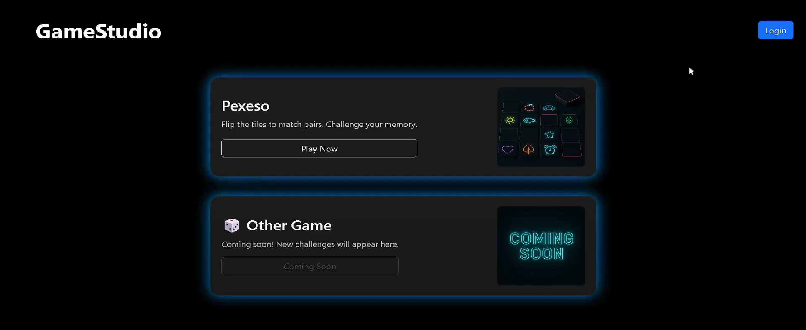
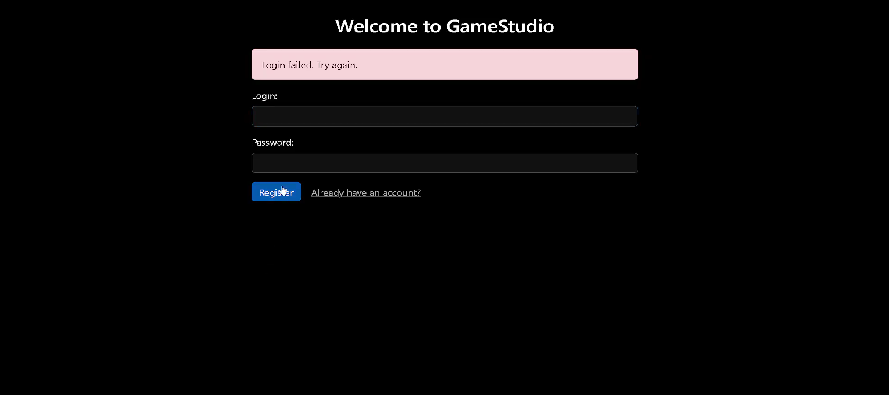
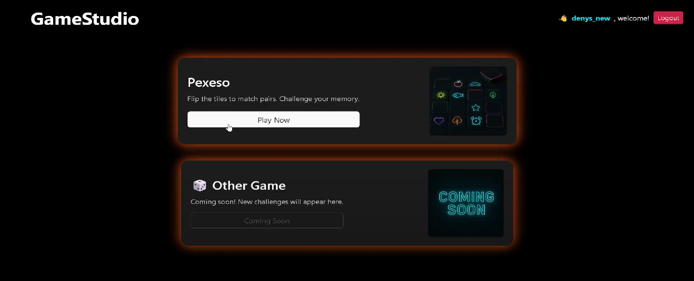
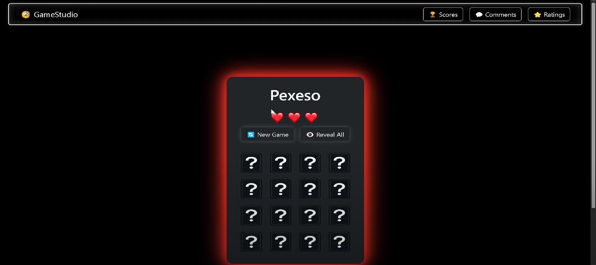
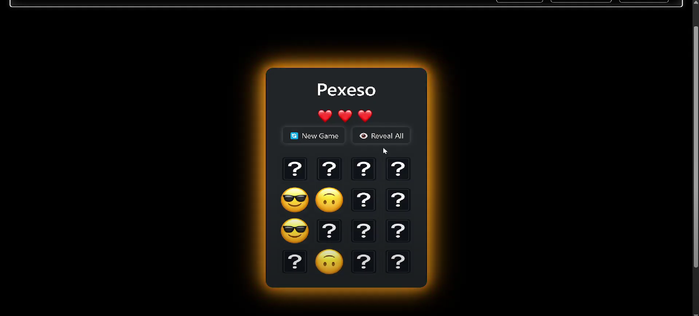
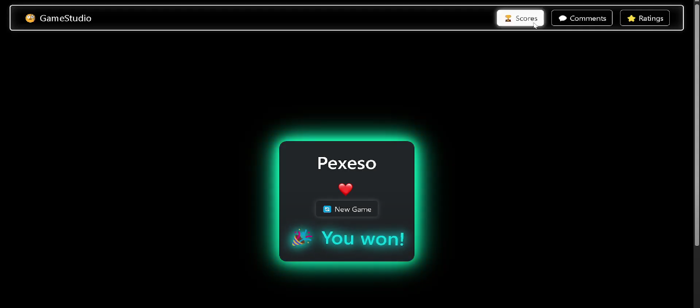
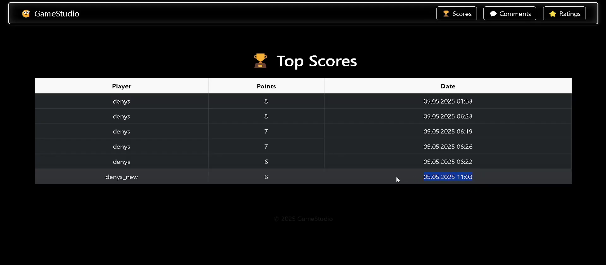
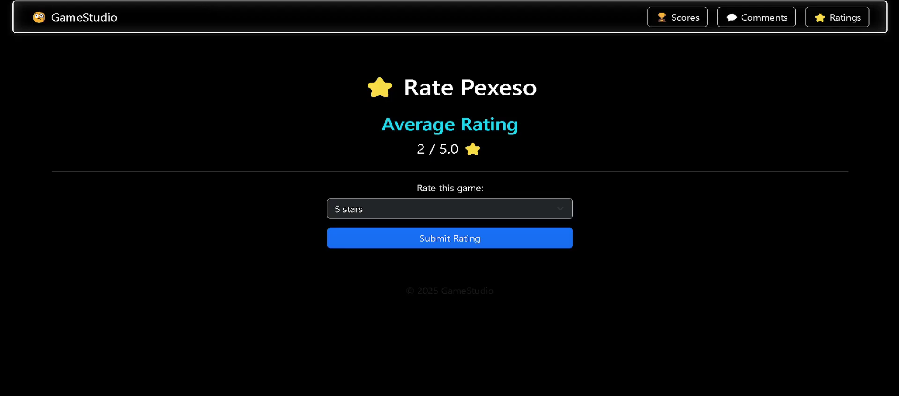

# 🎮 Java Web Game

A multiplayer web game with user ratings, comments, scoreboards, and PostgreSQL integration.

## 🌐 Technologies
- Java (OOP)
- PostgreSQL
- Web GUI (HTML/JavaScript/CSS)
- RESTful services
- Spring
- Thymeleaf

## ✨ Features
- User login/registration
- Post and view comments
- Add and update rating
- Highscore leaderboard
- Video demonstration

  
  
  
  
  
  
  
  
  

